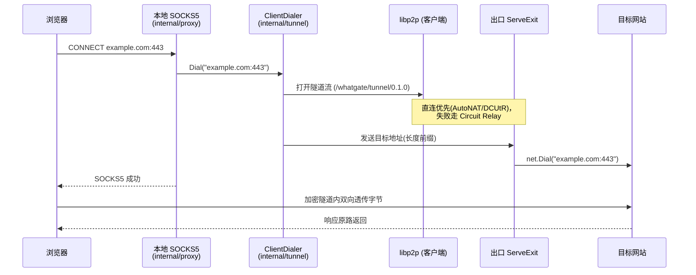

# WhatGate 架构说明

本文档面向贡献者，讲清楚 WhatGate 的整体架构、模块边界、数据流、协议与安全模型。使用体验见 [README](../README.md)。

## 1. 设计前提与两个平面

WhatGate 让所有在线用户组成一张网，每个节点**既是客户端也是出口**。核心目标是**地理位置解锁**：客户端按地区挑一个出口，让流量从该地区的 IP 出网。

一切设计围绕一条分界线展开——**控制面只碰元数据，数据面点对点加密**：

| 平面 | 承载 | 谁能看到流量 |
|---|---|---|
| **控制面** Coordinator（HTTP） | 邀请准入、节点目录、中继地址广播 | 看不到业务流量，只有元数据 |
| **数据面** libp2p | 真正的代理流量 | 端到端加密，直连时中间无人 |

协调服务器故意**不经手业务流量**：它宕机也不影响已建立的隧道，且它无法窥探用户在访问什么。

## 2. 组件总览

```mermaid
flowchart LR
    subgraph Client[客户端节点]
        Browser[浏览器/应用] -->|SOCKS5| Ingress[internal/proxy]
        Ingress -->|Dialer| CD[tunnel.ClientDialer]
    end

    subgraph CoordHost[Coordinator 主机]
        Coord[HTTP 控制面<br/>internal/coordinator]
        Relay[Circuit Relay v2<br/>internal/relay]
    end

    subgraph Exit[出口节点]
        EH[tunnel.ServeExit<br/>+ ExitGuard*] -->|net.Dial| Internet[(目标网站)]
    end

    Client -.->|join/register/directory/relay| Coord
    Exit -.->|register| Coord
    CD ==>|libp2p 加密隧道<br/>直连优先| EH
    CD -. 打洞失败 .->|经中继| Relay
    Relay -. 转发加密流 .-> EH

    style Relay stroke-dasharray: 4 4
```

\* `ExitGuard`（出口策略/信任范围/限额）在 M5 落地，当前出口仅有"默认关闭、显式 `-exit` 开启"这一层同意。

## 3. 一次解锁请求的数据流



选路发生在 `Dial` 之前：客户端先向 Coordinator 拉目录，用 `internal/routing.PickExit` 按地区（后续加测速/信任）挑出口，再 `Connect` 建立会话。

## 4. 模块边界

每个包职责单一、通过清晰接口通信，可独立测试：

| 包 | 职责 | 关键类型/函数 | 依赖 |
|---|---|---|---|
| `pkg/protocol` | 隧道 wire 协议 | `WriteTarget`/`ReadTarget` | 无 |
| `internal/tunnel` | 隧道两端逻辑（传输无关） | `ServeExit`、`ClientDialer` | `pkg/protocol` |
| `internal/proxy` | 本地 SOCKS5 入口 | `Server`、`Dialer` 接口 | 无（`Dialer` 注入） |
| `internal/node` | libp2p 接入 | `Node`、`WithStaticRelays`、`ReserveRelay` | libp2p、`tunnel` |
| `internal/relay` | Circuit Relay v2 服务 | `Relay` | libp2p |
| `internal/coordinator` | 目录、邀请、HTTP、客户端 | `Directory`、`InviteStore`、`Server`、`Client` | 无 libp2p（纯 HTTP/逻辑） |
| `internal/routing` | 选路 | `PickExit` | `coordinator` |
| `cmd/node`、`cmd/coordinator` | 装配可执行文件 | `main` | 上述 |

**解耦要点**：`internal/tunnel` 与 `internal/proxy` **不依赖 libp2p**——它们操作 `net.Conn`，所以核心逻辑用 `net.Pipe` 就能测；`internal/coordinator` 也不碰 libp2p，是纯 HTTP + 内存状态。libp2p 只集中在 `internal/node` 与 `internal/relay`。

## 5. 隧道协议

隧道流建立后，客户端先发目标地址，随后双向透传原始字节。

目标地址编码（`pkg/protocol`）：

```
+---------+------------------------+
| 2 字节  |        N 字节           |
| uint16  |  目标地址 "host:port"   |
| 大端 N  |     (UTF-8)            |
+---------+------------------------+
```

协议 ID：`/whatgate/tunnel/0.1.0`。

SOCKS5 入口（`internal/proxy`）实现 no-auth + CONNECT，支持 IPv4 / IPv6 / 域名三种地址类型；域名类型让 DNS 解析发生在**出口**侧（解锁的关键）。

## 6. NAT 穿透与中继兜底

数据面的连通性按以下顺序尝试（均由 libp2p 提供，`internal/node` 负责装配）：

1. **直连**：`NATPortMap` 端口映射 + `EnableNATService`（AutoNAT）。
2. **打洞**：`EnableHolePunching`（DCUtR）在双方 NAT 后协调直连。
3. **中继兜底**：打洞失败时，节点经 **Circuit Relay v2** 中转。
   - Coordinator 主机兼跑 `internal/relay`（用 circuitv2 `relay.New` **无条件**启用 hop 服务，绕开可达性门控）。
   - 节点通过 `/relay` 端点取得中继地址，用 `WithStaticRelays` 配置 AutoRelay；不可达时自动预约槽位并广播 `/p2p-circuit` 地址。
   - **注意**：中继连接在 libp2p 里是"受限连接"，在其上开流必须用 `network.WithAllowLimitedConn`——否则 `NewStream` 会一直等一条可能永远不存在的直连。`NewClientDialer` 已处理。

`internal/node` 另提供 `ReserveRelay`/`CircuitAddrsVia` 用于显式预约（测试与确定性场景用）。

## 7. 控制面 HTTP API

Coordinator 暴露的端点（JSON）：

| 方法 | 路径 | 作用 | 备注 |
|---|---|---|---|
| POST | `/join` | 兑换邀请码准入 | `{code, peerID}` → `{issuer}`；未知码 404，用尽 409 |
| POST | `/register` | 注册/刷新节点存在 | 需已准入，否则 403 |
| GET | `/directory` | 查询在线节点 | 返回未过期条目 |
| GET | `/relay` | 取中继地址 | 无中继时 404 |

节点侧对应 `coordinator.Client` 的 `Join`/`Register`/`Directory`/`Relay`。目录条目带 TTL，节点定期 `Register` 续期，停更即过期。

## 8. 信任与安全模型

### 当前（M1–M2）
- **出口显式同意**：不加 `-exit` 就不会成为任何人的出口。
- **邀请准入 + 可追溯**：每个成员经邀请码加入，`InviteStore` 记录"谁经哪张邀请、由谁签发"的准入链，为滥用追责奠基。

### 规划（M3+，见 §10 路线图）
- **分层联邦信任**：个人 → 小网(Group) → 小网间认证背书 → 大网；信任度按 自己小网 > 已认证友邻 > 陌生大网 递减，参与选路加权与硬过滤。
- **用户保护（防被非法之徒利用，第一优先）**：信任范围限定（只给信任圈当出口）、出口策略（域名黑白名单/禁高危端口/声誉门槛）、限额与熔断、威胁情报、首启动风险向导。

### 安全须知
- 出口方承担其出口流量的现实责任；"知情自愿 + 可追溯 + 出口保护"是本项目区别于被滥用的僵尸代理网络的根本。
- 切勿把私钥、令牌等提交入库（见 `.gitignore`）。

## 9. 测试策略

- 全程 **TDD（RED→GREEN）**，每个包都有测试。
- 传输无关的核心（`tunnel`/`proxy`/`protocol`/`coordinator`/`routing`）用 `net.Pipe`、`httptest`、内存状态测，快速且确定。
- libp2p 集成用**真实节点**在回环上测：两节点隧道、以及中继隧道（出口预约、客户端仅凭 circuit 地址连通）。
- 端到端用多进程编排脚本 + `curl --socks5-hostname` 验证真实出网。
- 局限：跨 NAT 的真实打洞/AutoRelay 自动预约需两台异网机器，回环无法覆盖。

## 10. 路线图

| 里程碑 | 内容 | 状态 |
|---|---|---|
| M1 | 骨架：SOCKS5 + 两节点直连出网 | ✅ |
| M2 | 组网：准入/目录/发现/NAT/中继兜底 | ✅ |
| M3 | 小网与信任：小网、认证背书、两级声誉、信任范围、向导 | ⬜ |
| M4 | 选路：地区 + 延迟/负载/信任度自动选最优 | ⬜ |
| M5 | 出口治理：ExitGuard 策略、限额熔断、可追溯、威胁情报 | ⬜ |
| M6 | 扩展：TUN 全局模式 → 移动端 | ⬜ |
