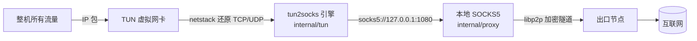
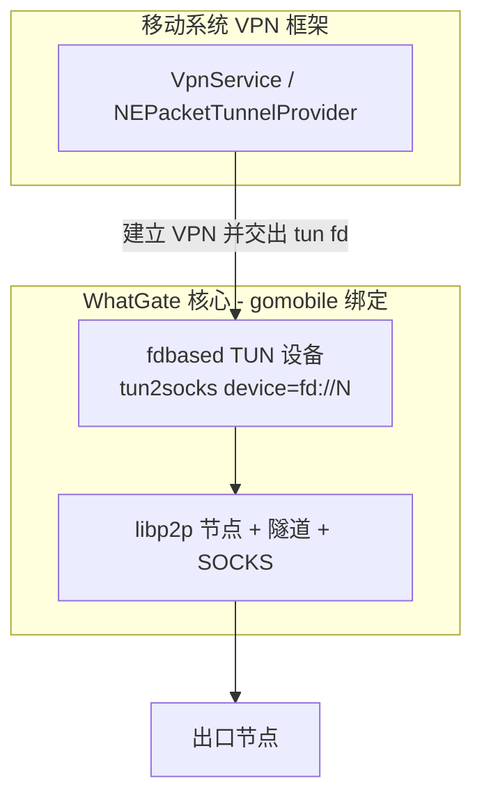

# M6：TUN 全局模式与移动端

本文档说明 WhatGate 的全局代理（TUN）模式如何构建与运行，以及移动端（Android/iOS）的接入设计。

> ⚠️ TUN 与移动端依赖内核级虚拟网卡驱动、管理员/系统权限与平台 SDK，无法像 M1–M5 那样在普通开发沙箱里端到端验证。桌面 TUN 的**代码可编译**（`internal/tun`，`-tags tun`），需你在带管理员权限的真机上运行验证。

## 1. TUN 全局模式（桌面）

### 原理

前面的里程碑把流量以 **本地 SOCKS5** 形式接入（浏览器/应用手动指向）。TUN 模式更进一步：创建一张**虚拟网卡**，把**整机的所有流量**捕获成 IP 包，经一个用户态网络栈（gvisor，via [tun2socks](https://github.com/xjasonlyu/tun2socks)）还原成 TCP/UDP 流，再转发给本节点的 SOCKS5 → 隧道 → 出口。体验等同 VPN，无需逐应用配置。



代码位置：`internal/tun`（`Config` + `Start`/`Stop`）。为避免默认二进制背上 gvisor 巨型依赖，TUN 实现放在 **`tun` 构建标签**后；默认构建用桩返回"未编入 TUN"。

### 构建

```bash
# 默认（精简，无 TUN）
go build -o bin/ ./...

# 含 TUN 支持（拉 gvisor/tun2socks，二进制更大）
go build -tags tun -o bin/node-tun ./cmd/node
```

### 运行（需管理员/root）

先确保节点处于客户端模式（有本地 SOCKS 在跑），再开 TUN：

```bash
# 例：经协调器发现 JP 出口，同时开全局 TUN
sudo ./node-tun -coordinator http://host:8080 -invite welcome \
     -to JP -trust-scope open -socks 127.0.0.1:1080 \
     -tun -tun-device whatgate0
```

平台前置条件与路由配置（**tun2socks 只负责收发包，不自动配路由**）：

- **Windows**：把 `wintun.dll`（[wintun.net](https://www.wintun.net/)，与 CPU 架构匹配）放在二进制旁；以管理员运行。创建适配器后需给它配 IP 并把默认路由指向它（`netsh interface ip set address ...` / `route add`），同时给协调器与出口的直连流量加**排除路由**（否则隧道自身流量也被卷进 TUN，形成回环）。
- **Linux**：`ip addr add`/`ip route`/`ip rule` 配置 TUN 及策略路由；出口/协调器地址走原网关。
- **macOS**：`utun` 设备 + `ifconfig`/`route`。

> 关键坑：**出口节点与协调器的连接必须绕开 TUN**（排除路由/分流），否则隧道流量被自己捕获会死循环。生产实现应在 `internal/tun` 里自动下发这些排除路由（当前留给运行者手动配置，属待增强项）。

### 待增强
- 自动路由/排除路由下发（免手动 `route add`）。
- UDP/DNS 分流策略、IPv6。
- 打包 `wintun.dll` 与安装器。

## 2. 移动端（Android / iOS）设计

移动端不能用桌面那套"创建网卡+配路由"——系统只允许通过 **VPN 扩展框架**拿到一个**已配置好的 TUN 文件描述符（fd）**，App 在其上收发包。好在架构是复用的：**核心（libp2p 节点 + 隧道 + SOCKS + tun2socks 的 fd 后端）保持不变，只换最外层的 fd 来源与 UI 外壳**。



### 落地路径

1. **核心编译为移动库**：用 [gomobile](https://pkg.go.dev/golang.org/x/mobile/cmd/gomobile) 把一个瘦封装包（暴露 `Start(configJSON, tunFD int) / Stop()`）`gomobile bind` 成 **Android 的 .aar** 与 **iOS 的 .xcframework**。tun2socks 已支持 **fd 后端**（`device=fd://<fd>`，见 `internal/tun` 里 Device 解析），正好吃系统给的 fd（iOS 需 4 字节包头偏移，tun2socks 已处理）。
2. **Android**：实现 `VpnService`，用 `Builder` 配好地址/路由/排除自身，`establish()` 得到 `ParcelFileDescriptor`，把其 fd 传给核心 `Start`。前台服务常驻。
3. **iOS**：实现 `NEPacketTunnelProvider`（Network Extension，需相应 entitlement 与付费开发者账号），从 `packetFlow` 取 fd 传入核心。
4. **UI 外壳**：原生（Kotlin/Swift）或跨端（Flutter/RN）做地区选择、出口开关、小网管理、首启动信任向导；仅调核心的 start/stop 与查询接口。

### 需要的工具链（本仓库环境不具备）
- Android：Android SDK/NDK、gomobile（`gomobile init`）。
- iOS：macOS + Xcode + Apple 开发者账号（Network Extension 权限）。

### 复用与新增边界

| 复用（已实现） | 移动端新增 |
|---|---|
| `internal/node`（libp2p、隧道、选路、Guard） | gomobile 瘦封装 + fd 入口 |
| `internal/proxy`、`internal/tunnel` | Android VpnService / iOS PacketTunnelProvider |
| `internal/coordinator`/`trust`/`routing`/`exit` | 原生/跨端 UI 外壳、首启动信任向导 |
| tun2socks 的 fd 后端 | 系统 VPN 权限申请与常驻 |
